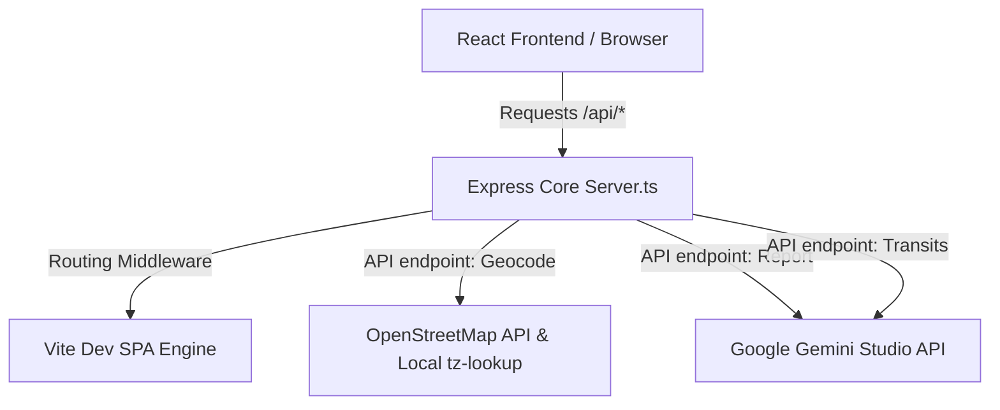

# 🌌 Local Host Execution & System Architecture Guide: Astroveda

Welcome to the comprehensive guide for running **Astroveda (Vedic Kundli Creator)** locally. Follow these steps to spin up the React (Vite) + Express application and connect it with standard API and AI configurations.

---

## 📋 Table of Contents
1. [Prerequisites Checklist](#-prerequisites-checklist)
2. [Step-by-Step Local Deployment](#-step-by-step-local-deployment)
3. [System Architecture & API Endpoints](#%EF%B8%8F-system-architecture--api-endpoints)
4. [Environment Configuration & Fallback Mode](#%EF%B8%8F-environment-configuration--fallback-mode)
5. [Troubleshooting & Support](#-troubleshooting--support)

---

## 📋 Prerequisites Checklist

Before running the application, make sure your computer has the following environment utilities installed:

| Utility | Recommended Version | Purpose | Verify Installation Command |
| :--- | :--- | :--- | :--- |
| **Node.js** | `v18.x` or higher (LTS recommended) | Standard runtime logic parser | `node -v` |
| **npm** | `v9.x` or higher | Repository dependency resolution management | `npm -v` |
| **Gemini API Key** | Optional | Required for complete premium AI astro readings | *(Saved in configuration secrets)* |

---

## 🚀 Step-by-Step Local Deployment

Follow these four direct steps to boot the web application on localhost:

### 1️⃣ Download Dependencies
Open your choice of terminal in the root directory (where [package.json](file:///home/rmusti/Astroveda/package.json) resides) and run the setup resolver:
```bash
npm install
```
> [!NOTE]
> This command downloads reference packages (React, Express, TailwindCSS, Vite engine wrappers, motion animation modules, etc.) defined in [package.json](file:///home/rmusti/Astroveda/package.json) into a newly formed local `node_modules` directory.

### 2️⃣ Configure Local Environment File
Create a new file named **`.env.local`** (or simply overwrite `.env`) in the root project space, and define the key variables as shown:
```ini
# GEMINI_API_KEY: Paste your Google Gemini AI key below (optional - see Fallback Mode section)
GEMINI_API_KEY="AIzaSyYourActualKeyHere..."

# APP_URL: Self-referential URL where this service runs (used for backend callback links)
APP_URL="http://localhost:3000"
```
> [!TIP]
> You can also copy the predefined template directly: `cp .env.example .env.local` and substitute the corresponding variable placeholder tokens.

### 3️⃣ Direct Server Boot (Development Mode)
Run the development runner system script to boot up both front-end and back-end simultaneously:
```bash
npm run dev
```

### 4️⃣ Opening the App
Once launched, you will see a console message confirming the port listener status. Open your preferred browser and navigate to:
```url
http://localhost:3000
```

---

## ⚙️ System Architecture & API Endpoints

Astroveda is engineered using a **Unified Dev Server Model** that guarantees rapid module reloading and clean isolation.



### Server Stack Breakdown ([server.ts](file:///home/rmusti/Astroveda/server.ts)):
- **Port Assignment**: Set to port **`3000`** by default on localhost bounds (`0.0.0.0:3000`).
- **Core Server**: Built using Node's robust **Express** framework.
- **Frontend Bridging**: In non-production contexts, it hooks directly into a Vite development system utilizing express middleware layers for sub-millisecond hot asset replacement.
- **Production Asset Server**: In production modes, Express automatically serves static HTML, CSS (TailwindCSS V4 compiled), and static production bundle blocks built from the `/dist` directory.

### Native Backend REST Interfaces:
1. **🌎 Geolocation resolver (`POST /api/geocode`)**:
   Connects out to OpenStreetMap's Public Nominatim Web Service to fetch address string structures, matching coordinates, and uses `tz-lookup` locally to figure out precise decimal zone time indices.
2. **🪐 Vedic report engine (`POST /api/kundli-report`)**:
   Consumes astronomically calculated chart configurations, assembles customized prompt data objects, and streams back professional analysis structures via **`gemini-3.5-flash`**.
3. **📅 Daily transit forecaster (`POST /api/transit-horoscope`)**:
   Correlates personal birth matrix parameters (Natal placements) with the active dynamic configurations of the cosmos today to frame daily advice using **`gemini-3.5-flash`**.

---

## 🛡️ Environment Configuration & Fallback Mode

One of Astroveda's best engineering traits is **Graceful Throttling & Fallbacks**.

### 💫 Automatic Fallback State
**What happens if you run the app without a valid `GEMINI_API_KEY`?**
The app **does not crash!** The custom backend detects a lack of key authorization and enters a fallback mode, still performing precise, authentic Vedic astrological calculations locally:

- **Local Kundli Calculations**: Calculating degrees, Sidereal Lagna (Lagna Rashi), Navamsha, Ayanamsa corrections (Lahiri), and drishti aspects works **100% locally** and instantly!
- **Mock Astrological Report**: The report continues to output precise calculated chart elements (Lagna, Moon house placements, Sun house alignments), along with localized advice urging user token activation.
- **Mathematical Transit Forecast**: Translates live daily planet locations in the heavens compared to natal settings natively, giving clear, computed cosmic guidelines!

---

## 🛠️ Troubleshooting & Support

### ❌ Port Conflict Error: "Address already in use (EADDRINUSE) on port 3000"
- **Cause**: Another service in the background is running and holding onto the standard local server port 3000.
- **Solution**: Terminate the background application, or shift Port configurations. Open [server.ts](file:///home/rmusti/Astroveda/server.ts#L39) and change the line assignment:
  ```typescript
  const PORT = 3000; // Switch this numerical definition to 3001, 8080, etc.
  ```

### ❌ Critical CSS System Errors or Missing Styles
- **Cause**: Missing TailwindCSS bundle compiler connections or package load failures.
- **Solution**: Clear build directories, force update npm configuration maps, and rebuild using clean flags:
  ```bash
  npm run clean
  npm install
  npm run dev
  ```

---

*Compiled with Astroveda's Technical Core Reference Sheets • Version 1.0 (2026)*
